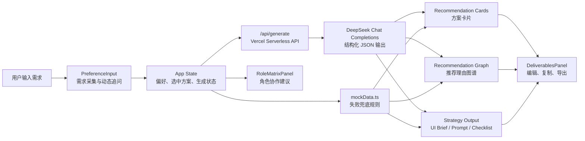
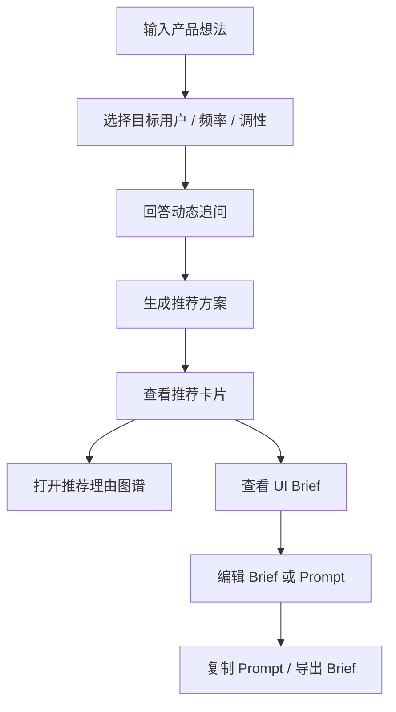

# AI PM UI Copilot

AI PM UI Copilot 是一个面向 AI 产品经理的 UI 方案生成与评估 Demo。用户可以输入产品想法、目标人群、使用频率和界面调性，系统会基于内置规则生成适合的界面方案卡片、UI Brief、Vibe Prompt 和角色协作建议。

当前版本是一个 Vite 前端应用，并通过 Vercel Serverless API 接入 DeepSeek 大模型。页面可以直接部署到 Vercel，API Key 通过 Vercel 环境变量保存，不会暴露在前端代码中。

## 目录

- [产品定位](#产品定位)
- [功能概览](#功能概览)
- [产品架构](#产品架构)
- [用户使用流程](#用户使用流程)
- [技术栈](#技术栈)
- [本地运行](#本地运行)
- [Vercel 部署](#vercel-部署)
- [环境变量](#环境变量)
- [目录结构](#目录结构)
- [GitHub 上传建议](#github-上传建议)
- [后续演进方向](#后续演进方向)

## 产品定位

AI PM UI Copilot 解决的是 AI 产品经理在早期构思界面时的三个问题：

- 想法很模糊，不知道适合做成工作台、任务流、看板还是生成器
- Vibe Coding Prompt 容易写得太泛，生成出来的界面像 Demo，不像真实产品
- 产品、设计、研发之间缺少一份能直接对齐的 UI Brief

因此，这个 Demo 的核心目标不是直接生成完整应用，而是把一段自然语言产品想法转化成更具体的 UI 方案判断、结构化 Brief、Prompt 和质量检查清单。

## 功能概览

- 输入模糊产品需求，生成 UI 方向建议
- 调用 DeepSeek 生成不同类型的界面方案
- 展示方案卡片、适配原因和决策图谱
- 生成可复制的 UI Brief 与 Vibe Coding Prompt
- 提供角色分工矩阵，辅助产品、设计、研发协作
- 内置示例需求，可快速体验完整流程

## 产品架构

当前版本采用前端单页应用 + Vercel Serverless API 架构。用户输入在浏览器中提交到 `/api/generate`，由服务端读取 `DEEPSEEK_API_KEY` 调用 DeepSeek，再返回结构化 UI 方案。



### 产品层模块

| 模块 | 作用 | 对应文件 |
| --- | --- | --- |
| 需求输入层 | 收集产品想法、目标用户、使用频率、视觉调性，并根据文本动态追问 | `src/components/PreferenceInput.tsx` |
| API 生成层 | 接收用户偏好，调用 DeepSeek 并返回结构化 JSON | `api/generate.js` |
| 兜底决策层 | 当 API 不可用时，根据关键词和用户偏好生成本地推荐方案 | `src/mockData.ts` |
| 方案展示层 | 展示推荐卡片、优缺点、适配场景和核心组件 | `src/components/RecommendationCardComponent.tsx` |
| 决策解释层 | 用图谱方式解释为什么推荐该方案 | `src/components/RecommendationGraph.tsx` |
| 交付物层 | 输出可编辑 UI Brief、Vibe Prompt、质量检查表，并支持复制和导出 | `src/components/DeliverablesPanel.tsx` |
| 协作层 | 展示产品、设计、研发等角色的分工建议 | `src/components/RoleMatrixPanel.tsx` |

### 数据流

1. 用户在左侧输入产品需求，并选择用户群体、使用频率和调性。
2. `PreferenceInput` 将表单数据整理成 `UserPreferences`。
3. `App.tsx` 接收偏好数据，更新全局状态。
4. `/api/generate` 读取服务端环境变量 `DEEPSEEK_API_KEY`，调用 DeepSeek 生成三类输出：
   - `RecommendationCard[]`: 推荐方案卡片
   - `GraphNode[] / GraphEdge[]`: 推荐理由图谱
   - `StrategyOutput`: UI Brief、Vibe Prompt、Checklist
5. 如果 API 请求失败，前端会回退到 `mockData.ts` 的本地规则，保证页面仍可使用。
6. 页面右侧展示最终交付物，用户可以编辑、复制或导出。

### 当前架构特点

- 服务端保护 API Key：DeepSeek Key 只存在于 Vercel 环境变量中
- 无数据库：刷新后不会持久保存用户编辑内容
- 大模型生成 + 本地兜底：正常情况下使用 DeepSeek，异常时回退 mock 规则
- 组件拆分清晰：输入、推荐、解释、交付物相互独立，便于后续接入真实 AI API

## 用户使用流程



典型使用场景：

- 产品经理在做新工具前，快速判断产品界面形态
- Vibe Coding 前，把一句粗糙需求扩写成更可执行的 Prompt
- 与设计或研发沟通前，生成一份结构化 UI Brief
- 对 Gemini Coding、Cursor、Codex 等生成结果做质量检查

## 技术栈

- React 19
- TypeScript
- Vite
- Tailwind CSS
- Lucide React
- Motion

## 设计原则

这个项目的界面和生成逻辑围绕以下原则设计：

- 工具优先：首屏直接进入工作台，不做营销型 Landing Page
- 解释推荐：不只给方案，也展示推荐理由和取舍
- 可交付：输出内容面向产品、UX 和研发协作，而不是只展示摘要
- 防 Demo 化：强调真实状态、错误处理、数据密度、组件边界和可执行交互
- 轻部署：优先保证 GitHub + Vercel 可以快速上线

## 本地运行

### 环境要求

建议使用 Node.js 20 或更高版本。

### 安装依赖

```bash
npm install
```

### 启动开发环境

```bash
npm run dev
```

默认会启动在：

```text
http://localhost:3000
```

### 生产构建

```bash
npm run build
```

构建产物会生成在 `dist/` 目录。

### 本地预览生产包

```bash
npm run preview
```

### 类型检查

```bash
npm run lint
```

当前 `lint` 脚本实际执行的是 TypeScript 类型检查：

```bash
tsc --noEmit
```

## Vercel 部署

这个项目可以使用 Vercel 的默认 Vite 配置部署。

推荐配置：

- Framework Preset: `Vite`
- Install Command: `npm install`
- Build Command: `npm run build`
- Output Directory: `dist`

部署步骤：

1. 将项目上传到 GitHub。
2. 在 Vercel 中选择该 GitHub 仓库。
3. Framework 选择 `Vite`。
4. 保持默认构建配置，确认 Output Directory 为 `dist`。
5. 点击 Deploy。

## 环境变量

当前版本需要在 Vercel 中配置 DeepSeek API Key，才能使用真实大模型生成能力。

必需变量：

```text
DEEPSEEK_API_KEY=你的 DeepSeek API Key
```

安全注意：

- 不要在前端直接暴露私有 API Key
- 不要把真实 API Key 提交到 GitHub
- 将 Key 放到 Vercel Project Settings 的 Environment Variables 中
- 如果 Key 曾经出现在聊天、截图或公开页面中，建议在 DeepSeek 控制台重新生成并替换

## 目录结构

```text
.
├── src/
│   ├── components/
│   │   ├── DeliverablesPanel.tsx
│   │   ├── PreferenceInput.tsx
│   │   ├── RecommendationCardComponent.tsx
│   │   ├── RecommendationGraph.tsx
│   │   └── RoleMatrixPanel.tsx
│   ├── App.tsx
│   ├── index.css
│   ├── main.tsx
│   ├── mockData.ts
│   └── types.ts
├── index.html
├── api/
│   └── generate.js
├── package.json
├── package-lock.json
├── tsconfig.json
└── vite.config.ts
```

## 核心文件说明

- `src/App.tsx`: 应用主入口，负责整体状态、推荐流程和页面布局
- `api/generate.js`: Vercel Serverless API，负责服务端调用 DeepSeek
- `src/mockData.ts`: 内置推荐规则、示例内容和生成数据
- `src/types.ts`: TypeScript 类型定义
- `src/components/PreferenceInput.tsx`: 用户需求输入区
- `src/components/RecommendationCardComponent.tsx`: 推荐方案卡片
- `src/components/RecommendationGraph.tsx`: 推荐理由和图谱展示
- `src/components/DeliverablesPanel.tsx`: 交付物、Brief 和 Prompt 展示
- `src/components/RoleMatrixPanel.tsx`: 角色协作矩阵展示

## GitHub 上传建议

建议提交这些文件：

- `src/`
- `assets/`
- `index.html`
- `package.json`
- `package-lock.json`
- `tsconfig.json`
- `vite.config.ts`
- `.gitignore`
- `.env.example`
- `README.md`

不要提交：

- `node_modules/`
- `dist/`
- `.env`
- `.env.local`
- 系统临时文件，例如 `.DS_Store`

`.gitignore` 已经排除了常见的依赖、构建产物和环境变量文件。

## 当前状态

已验证：

- `npm install` 可以正常安装依赖
- `npm run lint` 可以通过 TypeScript 检查
- `npm run build` 可以成功生成生产构建产物

因此，当前版本已经具备上传 GitHub 并部署到 Vercel 的基础条件。

## 上线前检查清单

- [x] 可以安装依赖
- [x] 可以通过 TypeScript 检查
- [x] 可以生成生产构建产物
- [x] 已接入 DeepSeek 服务端 API
- [x] 已通过 Vercel 环境变量保存 API Key
- [x] `node_modules/` 已被 `.gitignore` 排除
- [x] `dist/` 已被 `.gitignore` 排除
- [ ] 初始化 Git 仓库
- [ ] 创建 GitHub 仓库并推送代码
- [ ] 在 Vercel 绑定 GitHub 仓库
- [ ] 部署后检查页面标题、移动端布局和主流程交互

## 后续演进方向

如果这个 Demo 后续要从展示型 Demo 升级为可持续使用的产品，可以优先考虑：

- 接入真实 AI API，把本地规则生成升级为模型生成
- 增加服务端 API，避免在浏览器暴露 API Key
- 增加用户保存能力，持久化历史 Brief 和 Prompt
- 增加登录和项目空间，支持多项目管理
- 增加 Prompt 版本管理，方便比较不同方案
- 增加导出 Markdown、PDF 或飞书文档的能力
- 增加示例截图，让 GitHub README 更适合对外展示

## License

本项目使用 MIT License。详见 `LICENSE`。

授权范围仅限本仓库中的 AI PM UI Copilot 项目文件。该授权不适用于作者的其他项目、私人文件、未发布材料、API Key、环境变量或任何未包含在本仓库内的文件。
